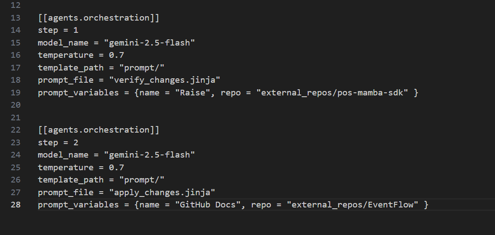

# GithubDocs

This project utilizes [uv](https://github.com/astral-sh/uv), an ultra-fast Python package installer and manager that also includes the Ruff linter/formatter.

Additionally, the project manages dependencies from external repositories for documentation generation via Git submodules.

## Installation and Setup

### 1. Prerequisites

Install `uv` on your system:

  
#### Via curl (Linux/macOS)
``` bash
# for Linux
curl -LsSf https://astral.sh/uv/install.sh | sh

# for Windows
powershell -ExecutionPolicy ByPass -c "irm https://astral.sh/uv/install.ps1 | iex"
```

#### Via pip
```bash
pip install uv
```

### 2\. Cloning the Repository

To clone this repository for the first time, including submodules, use the command:

```bash
git clone --recursive <this-repo-url>
```

If you have already cloned the repository without submodules, initialize them with:

```bash
git submodule init
git submodule update
```

### 3\. Installing Python Dependencies

With the repository cloned, create a virtual environment and install the dependencies:

```bash
# Install project dependencies
uv sync
```

## Usage

## Submodule Management

This project uses Git submodules to manage external repositories used as test subjects. They are located in the `external_repos/` directory.
The GitModules is just used as Formality and Testability. You could find interest cases, about this git modules, to test in this google sheets: https://docs.google.com/spreadsheets/d/1tR-glo3Wky11PWpasvBAdzWIHSlkXx9W76VPLKVU_Vk/edit?gid=911701213#gid=911701213.

You also could specify repositories in your computer that are not in the git modules, see more about the variable **repo_path** in the "Config File Structure".

### Adding a New Submodule

To add a new repository as a submodule:

```bash
git submodule add <repository-url> external_repos/<repo-name>
```

### Updating Submodules

To update all submodules to their latest commits on the default branch:

```bash
git submodule update --remote
```

To update a specific submodule:

```bash
git submodule update --remote external_repos/<repo-name>
```

### Folder Creation

To run the application, you will need to create two folders in the repository: `output` and `logs`.

You can create these folders by running the following command:
```bash
mkdir output logs
```

# Configuration Documentation

## Config File

The configuration file must be passed as an argument when running the application. The `conf/` directory contains a simple example that sets up the framework to analyze the EventFlow repository. Please note that this example is intended for demonstration purposes only and is not suitable for real test scenarios.

## Config File Structure

### [target_information]

This section specifies the target repository that will be analyzed.

#### repo_path
The path to the Git repository. This can be an absolute path on your file system or a relative path within this project. This variable is mandatory and does not have a default value.

Two validations are performed on this path:
1.  Checks if the specified path exists.
2.  Verifies if it is a valid Git repository.

#### branch_name
The specific branch of the repository you wish to analyze. This variable is mandatory and does not have a default value.

#### commit_list
Commit list as the name suggests, is a list of commits separated by a comma. You can also simplify a range of commits by adding a colon or two dots between two commits. You could check the examples below.

##### Range example
```Python
commit_list = ["a962c3657a3c90f5132a479ab6aac4fbbade9996:bb820fef78d2b8476733d9b21fa7cce1421a7ba3"]
```

##### Distinct example
``` Python
commit_list = ["6bcade563d627ea3d2b35f59d4d5dee56d6ea6a","a962c3657a3c90f5132a479ab6aac4fbbade9996"]
```

### [[agents.output]]

#### result & log paths
These paths specify where the framework will write the generated results and logs. It is crucial that these directories exist before running the application. If they do not exist, a `KeyError: Path does not exist` will occur.

#### result_file_name
The desired file name for the output. Ensure this adheres to any naming conventions specified in your prompt. There is no automatic validation between the file extension and the actual output format.

### [[agents.orchestration]]

This section configures the orchestration of agents, defining their execution order and model parameters.

#### step
A numerical value defining the execution order of this agent within the orchestration sequence. Lower numbers execute first.

#### model_name
The specific name of the Large Language Model (LLM) to use (e.g., `gemini-2.5-flash`). Using a generic name like `gemini` will result in an error.

#### temperature
This parameter controls the randomness of the model's output. It is a standard LLM parameter, typically a float between 0.0 and 1.0.

#### template_path
The absolute or relative path to the directory containing your Jinja prompt templates.

#### prompt_file
The name of the Jinja template file (e.g., `my_prompt.jinja`) that will be rendered to create the actual prompt sent to the LLM.

Jinja is a powerful templating tool that allows for dynamic prompt generation. It enables you to embed Python logic within your prompt files, making it possible to create highly flexible and robust prompts that can adapt to varying inputs and scenarios.

#### prompt_variables
These are simple key-value pairs that can be passed into your Jinja prompt templates. They are accessible within the template using the `{{ variable_name }}` syntax. The variables are defined as a dictionary.

Example of `prompt_variables` in the configuration:

```python
{repo_name = "EventFlow", repo_description= "EventFlow is a basic CQRS+ES framework designed to be easy to use."}

```
This variable could appear in the prompt where you mention it between curly braces. Example:
```jinja
Use the following repository data:
Repository Name: {{ repo_name }}
Repository Description: {{ repo_description }}
Repository Language: {{ repo_info.extensions }}
License: {{ repo_info.license }}
```

## Prompt Creation

The prompt files are based on Jinja templates. Below is a basic usage example. For further information on Jinja templating functionalities, you can check this link: https://jinja.palletsprojects.com/en/stable/

**Example:**

```jinja

Commit: {{ commit.hash }}
Author Date: {{ commit.date }}
Message: {{ commit.message }}
Modifications:

  File: {{ file_path }}
  Change Type: {{ modification.change_type }}
  Added Lines: {{ modification.added_lines }}
  Source code before: {{modification.source_code_before}}
  Diff:
  {{ modification.diff }}


```

This example is in the `prompt` folder with the name `orchestration.jinja`.

This prompt is rendered by a function that receives a dictionary. The dictionary we use internally has the following structure:

```python
commit_info = {
    "hash": "",
    "date": "",
    "message": "",
    "modifications": {
        "file_name_id": {
            "change_type": "",
            "added_lines": "",
            "diff": "",
            "source_code_before": ""
        }
    }
}
```

**Note:** `file_name_id` acts as a unique identifier for each changed file within the `modifications` dictionary. All information automatically extracted from the repository will be placed into this structure.

# Running the Project

You must pass the path to a **configuration file** as an argument to `main.py`. Ensure that this configuration file follows the **TOML format**.

### Basic Execution

```bash
python main.py conf/config.toml
```
-----

### Optional Flags

The project supports two additional optional flags:

  * **`--debug`**: Enables **verbose logging** for enhanced troubleshooting.
  * **`--mock`**: Prints the **rendered AI prompt** (based on your configuration) directly to the terminal without sending it to the external AI service. This flag is **intended solely for testing and verification purposes**.

### Example with Flags

```bash
python main.py conf/config.toml --mock --debug
```
---

# Templates

At the root of the project there is a **`prompts/`** folder, responsible for centralizing all prompts templates used by the LLMs (Gemini, ChatGPT, and local models).  
Each prompt is written in **Jinja**, allowing dynamic context injection (commits, diffs, files, outputs from previous steps, etc.).


###  Prompts Structure

Currently, the `prompts/` folder contains the following files:

- **`changelog.jinja`**  
  Prompt responsible for generating **changelogs** from commits, diffs, or repository history.

- **`readme.jinja`**  
  Prompt used to **create a README from scratch**, based on the project context.

- **`readme_update.jinja`**  
  Prompt used to **update an existing README**, taking into account:
  - recent commits  
  - diffs  
  - additional context provided by the framework  

  ###  Execution Flows

The framework supports two types of prompt execution:

#### ✅ Single-step execution
Most prompts are executed in a **single step**, where context is sent to the LLM and the result is applied directly.

Examples:
- `changelog.jinja`
- `readme.jinja`
- `readme_update.jinja`

#### 🔍 Multi-step execution (2 steps or more)

For more sensitive scenarios (such as automated updates), the framework uses a **two or more steps execution flow**, providing greater control and safety over generated changes.

###  two-steps update readme:

1. **`verify_changes.jinja`**  
   - Analyzes the provided context  
   - Returns **only the proposed modifications**, if any  
   - Does not apply changes directly  

2. **`apply_changes.jinja`**  
   - Receives the output from the previous step  
   - Applies the returned modifications using an LLM  


   ### 🔗 Step-to-Step Communication

To enable chained multi-step execution, the framework uses the special variable:

```jinja
{{ last_step_output }}
```

This variable automatically injects into the current prompt the output generated by the previous step, allowing the LLM to:

* analyze
* refine
* or apply changes based on the prior result

example: 


this is a two-step update readme:


